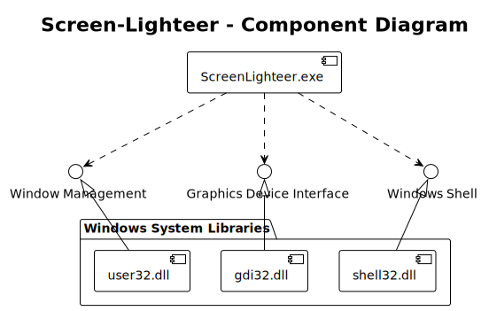
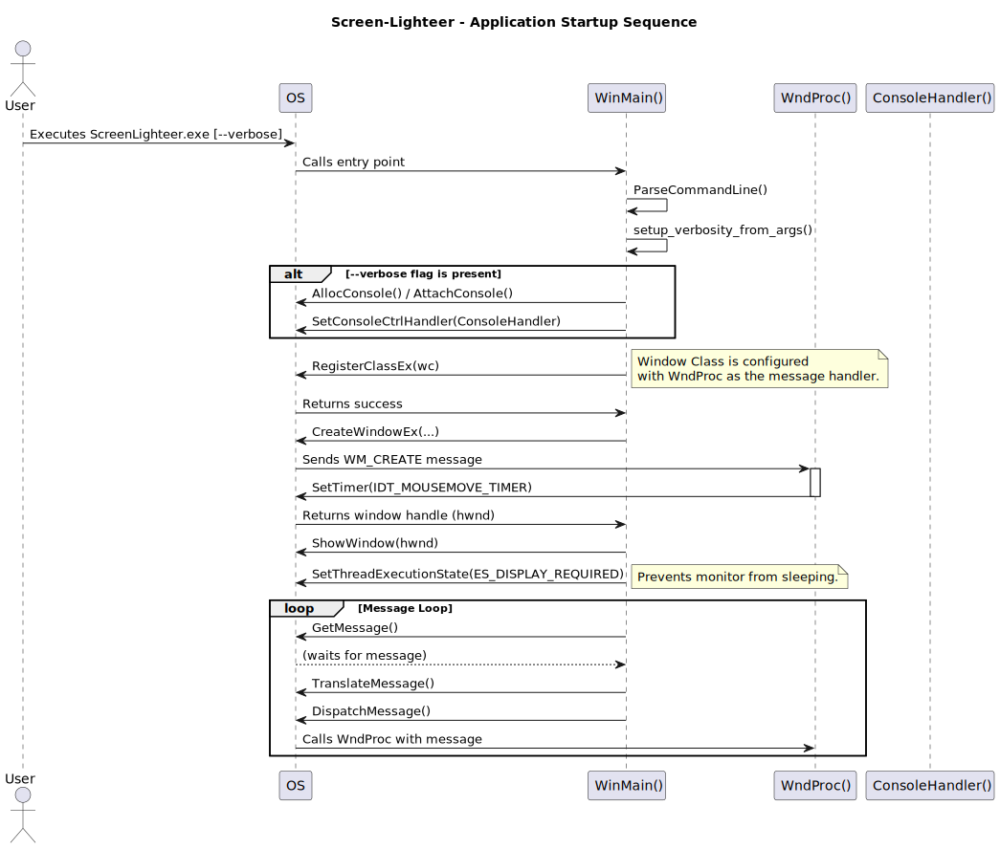
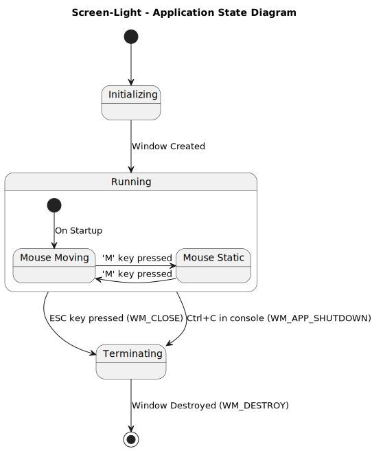
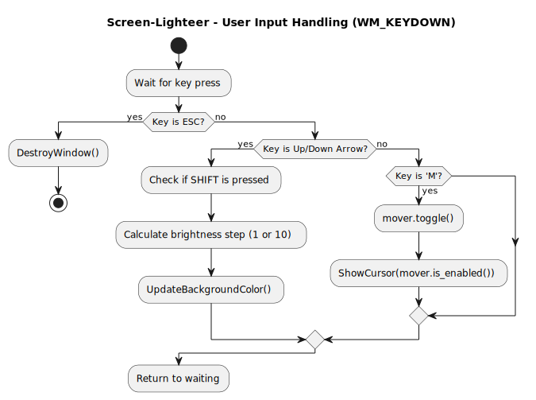
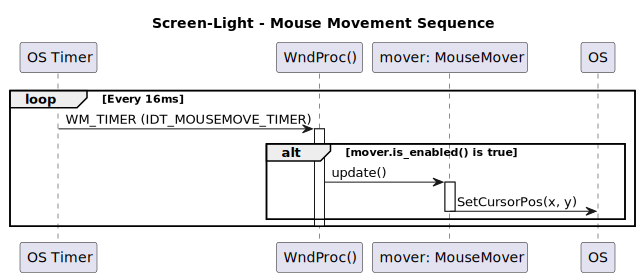

# Screen Light

A simple Windows utility that turns your monitor into a soft, adjustable light source, perfect for illuminating your face during video conferences, while also preventing the system from sleeping.

## Features

- **Video Conference Lighting**: Provides a bright, full-screen white display to act as a key light, improving video quality in low-light environments.
- **Adjustable Brightness**: Use the `Up` and `Down` arrow keys to change the brightness of the screen light.
- **Keeps System Awake**: Uses the Windows Power Management API to robustly prevent the system from sleeping. It also gently moves the mouse cursor as a visual indicator, which can be toggled on or off.
- **Minimalist Design**: Creates a fullscreen, borderless window. The mouse cursor can be toggled off for a completely distraction-free display.
- **Standalone Executable**: Builds a single, portable `.exe` file with no external dependencies, thanks to static linking. It can be run from any Windows machine.
- **Silent Operation**: Runs as a true background application without a console window by default.
- **Verbose Logging**: An optional `--verbose` flag can be used to open a console window for diagnostic messages.
- **Easy Controls**: Adjust brightness coarsely or finely and quit the application with simple keyboard commands.

## Installation

The easiest way to install Screen Light is via the Windows Package Manager (winget). Open a Command Prompt or PowerShell and run:

```powershell
winget install CosmicDNA.ScreenLight
```

> [!NOTE]
> Alternatively, you can download the [latest release](https://github.com/CosmicDNA/screen-light/releases/latest) from the GitHub Releases page. Download the `ScreenLight-windows-x64.zip` file, extract it, and run `ScreenLight.exe`.


## Usage

Copy `ScreenLight.exe` to any Windows machine and run it.

- **Standard Mode**:
  ```
  ScreenLight.exe
  ```
  This will launch the fullscreen white window and start moving the mouse. Press `ESC` to quit.

- **Verbose Mode**:
  ```
  ScreenLight.exe --verbose
  ```
  This will launch the application and also open a separate console window to display log messages. Press `ESC` to quit, or `Ctrl+C` in the console window.


> [!TIP]
> Use the `Up` and `Down` arrow keys to change the brightness of the screen light.
> To achieve a finer brightness control, hold `Shift` when pressing `Up` and `Down`,
> Press `M` to toggle the mouse cursor movement on and off.


## Building From Source

### Requisites

This project is set up for cross-compilation from a Linux environment to Windows. You will need the following tools installed:

- CMake (version 3.20 or newer)
- Ninja Build System
- MinGW-w64 Toolchain (specifically the `x86_64-w64-mingw32` target)

On Debian/Ubuntu-based systems, you can install these with:
```bash
sudo apt-get update
sudo apt-get install cmake ninja-build g++-mingw-w64-x86-64
```

### Building Commands

The project uses CMake Presets for a simplified and reproducible build process.

1.  **Configure the project** (for a release build):
    ```bash
    cmake --preset mingw-release
    ```

2.  **Build the executable**:
    ```bash
    cmake --build --preset release
    ```

The final executable, `ScreenLight.exe`, will be located in the `build/mingw-release/` directory.


## Architecture Diagrams

The project's architecture and runtime behavior are visualized in the diagrams below. The PlantUML source files for these diagrams can be found in the `diagrams` directory and can be viewed or edited using a PlantUML-compatible tool, such as the PlantUML extension for VS Code.

**Figure 1** provides a high-level component diagram, illustrating how `ScreenLight.exe` interacts with essential Windows system libraries like `user32.dll`, `gdi32.dll`, and `shell32.dll`.

<p align="center">
  
  <br>
  <em>Figure 1: Component Diagram showing high-level components and dependencies.</em>
</p>

The application's startup process is detailed in the sequence diagram in **Figure 2**. It shows the flow from the user executing the program to the main message loop being ready to handle events.

<p align="center">
  
  <br>
  <em>Figure 2: Startup Sequence detailing the application's initialization process.</em>
</p>

**Figure 3** is a state diagram that illustrates the application's primary states—Initializing, Running (with sub-states for mouse movement), and Terminating—and the events that trigger transitions between them.

<p align="center">
  
  <br>
  <em>Figure 3: Main State Diagram illustrating the application's lifecycle.</em>
</p>

The logic for handling user keyboard input, such as adjusting brightness or toggling mouse movement, is described in the activity diagram in **Figure 4**.

<p align="center">
  
  <br>
  <em>Figure 4: Input Handling Activity describing the logic for keyboard input.</em>
</p>

Finally, **Figure 5** shows a sequence diagram for the timer-based mouse movement, illustrating how the `WM_TIMER` message periodically triggers an update to the cursor's position.

<p align="center">
  
  <br>
  <em>Figure 5: Mouse Movement Sequence showing the timer-based cursor updates.</em>
</p>